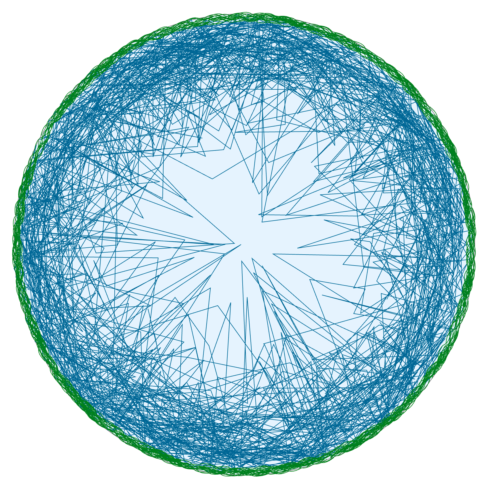
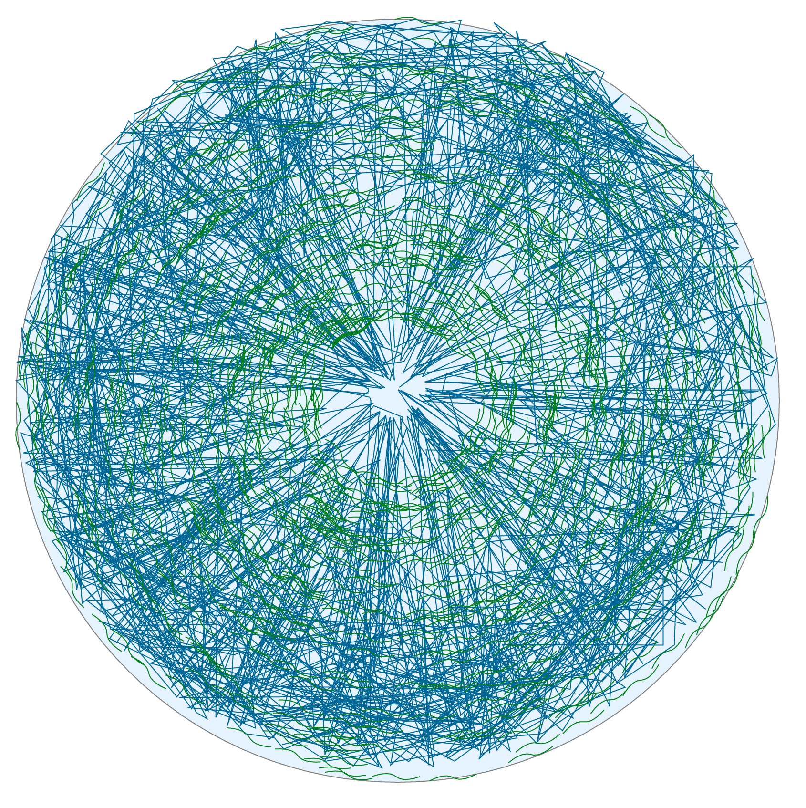

The app is intended to generate an SVG toy-illustration of how the cell nucleus is organized. In particular, it models the packaging of chromatin in random-walk fashion and uniformely distributes the molecules of nuclear envelope (Lamin molecules) throuout the nuclear space. The closeness of Lamin to the nuclear envelope can be adjusted by the `LAMIN_RADIAL_DENSITY` parameter.

Motivation: Lamin molecules attract and hold chromatin fibers, shape its eventual radial distribution and, consequently, manage the overall gene expression of nucleus. The abscence of Lamin or the presence of damaged Lamin molecules (e.g. due to some point mutation in Lamin gene) may affect the distribution of chromatin and introduce dramatic changes in gene expression, which leads to various desiases in humans and animals from the moderate muscular distrophy to early death.

An example of normal nucleus (The green molecules of Lamin B is attached to the envelope and chromatin tends to walk toward the periphery):

An example of Lamin B - mutant nucleus (Both Lamin and chromatin is evenly distributed).
